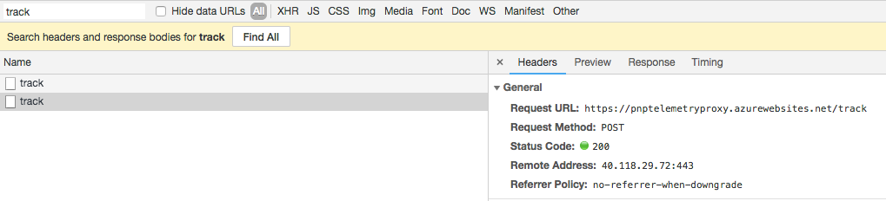
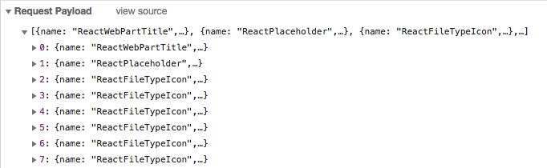

# PnP JavaScript based telemetry

The JavaScript based telemetry project has been created in order to track usage of the client-side PnP libraries like [@pnp/spfx-controls-react](https://github.com/SharePoint/sp-dev-fx-property-controls) and [@pnp/spfx-property-controls](https://github.com/SharePoint/sp-dev-fx-controls-react).

Initially, the projects made use of Application Insights, but over time it appeared that Application Insights does not yet support multiple configurations and/or account keys. Due to this, it prevents other developers from adding Application Insights to their own project, or the PnP Application Insights filters get overwritten.

This dependency will use the following API endpoint for usage tracking: `https://pnptelemetryproxy.azurewebsites.net/track`. For more information about the code of our API you can checkout the following repository: [PnP Telemetry Proxy](https://github.com/pnp/telemetry-proxy-node).

## What do we track?

Only events are tracked that get initiated from PnP client-side code. For example in the `@pnp/spfx-controls-react` we track the used controls. You can check it yourself in your browser by opening the network tab and search for the call to the following endpoint: `https://pnptelemetryproxy.azurewebsites.net/track`.



Here you can see the request payload:



The request payloads is similar like an Application Insights events object:

```json
[{
  "name": "ReactWebPartTitle",
  "properties": {
    "version": "1.1.1",
    "controlType": "react",
    "debug": "true",
    "environment": "SharePoint",
    "title": false,
    "updateProperty": true,
    "className": false
  }
}, {
  "name": "ReactPlaceholder",
  "properties": {
    "version": "1.1.1",
    "controlType": "react",
    "debug": "true",
    "environment": "SharePoint"
  }
}]
```

# Have issues or questions?

Please use following logic on submitting your questions or issues to right location to ensure that they are noticed and addressed as soon as possible.

* You have general question or challenge with SPFx - use [sp-dev-docs repository issue list](https://github.com/sharepoint/sp-dev-docs/issues).
* You have issue on specific controls in this package - use [issue list in this repository](https://github.com/pnp/telemetry-js/issues).

## Contributing

This project welcomes contributions and suggestions.  Most contributions require you to agree to a
Contributor License Agreement (CLA) declaring that you have the right to, and actually do, grant us
the rights to use your contribution. For details, visit https://cla.microsoft.com.

When you submit a pull request, a CLA-bot will automatically determine whether you need to provide
a CLA and decorate the PR appropriately (e.g., label, comment). Simply follow the instructions
provided by the bot. You will only need to do this once across all repos using our CLA.

This project has adopted the [Microsoft Open Source Code of Conduct](https://opensource.microsoft.com/codeofconduct/).
For more information see the [Code of Conduct FAQ](https://opensource.microsoft.com/codeofconduct/faq/) or
contact [opencode@microsoft.com](mailto:opencode@microsoft.com) with any additional questions or comments.

## "Sharing is Caring"

## Disclaimer

**THIS CODE IS PROVIDED *AS IS* WITHOUT WARRANTY OF ANY KIND, EITHER EXPRESS OR IMPLIED, INCLUDING ANY IMPLIED WARRANTIES OF FITNESS FOR A PARTICULAR PURPOSE, MERCHANTABILITY, OR NON-INFRINGEMENT.**